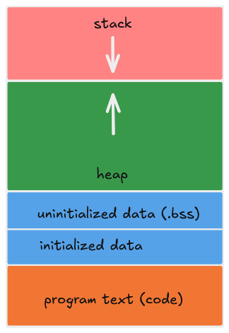
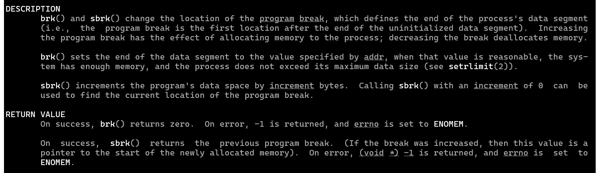
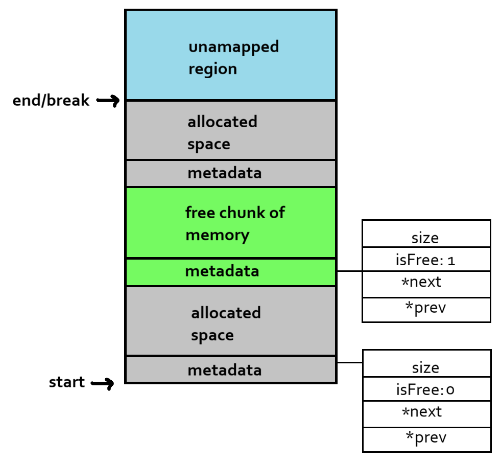

# 1. What is `malloc`?

What is `malloc`? If you haven't even heard the name, you should probably stop reading this and get familiar with the C programming language and come back to this... tutorial?

For programmers like you and I, `malloc` is a function from the standard C library that lets the programmer **allocate memory chunks**. Instead of reserving memory at compile time, it lets you request a block of memory of certain size at runtime. It returns a pointer to the start of the allocated memory block. This memory block is uninitialized, i.e., it may contain garbage value. It is the programmer's responsibity to take care of the memory, like using it or freeing after user, after it has been allocated.

The signature of the function looks something like this:

```c
void* malloc(size_t size);
```

Where `size` is the requested size.

I am going to implement a basic version of the standard malloc and its related functions.

<br>

# 2. A Process’s Memory

Each process running inside a computer has its own virtual address space, which is dynamically mapped to physical address by the operating system. This space/memory is divided into several parts:

1. Code/ Program Text
2. Data
3. Heap
4. Stack



All we have to know is that a process has space for its code, a region for constant and global variables, a stack for local and temporary data, and an unorganized space for program’s data called the heap. We are mostly interested on the heap segment right now. Before implementing our own `malloc`, we need to understand the heap and how memory is managed within it.

## 2.1 Heap

The heap is a continuous (in terms of virtual address) space of memory. It has three bounds:

1. Start of the heap
2. The break (top of the heap) which marks the end of the mapped region.
3. The maximum limit (rlimit) of the heap, that the break cannot go past.


In order to code a `malloc`, we need to

1. know where the heap begins
2. know the position of the break
3. be able to move the break as needed (using `brk` & `sbrk`) to grow or shrink the mapped region

## 2.2 `brk()` and `sbrk()`

`brk()` is used to move the break to the given address. It returns 0 on success and -1 otherwise on failure.

```c
int brk(void *addr);
```

`sbrk()` increments the break pointer by a specified number of bytes. It returns the previous program break on success and an `(void*) -1` (error pointer) on failure.

```c
void *sbrk(intptr_t increment);
```



<br>

# 3. Implementation

We need a structure to represent our heap and memory chunks. While there are many ways to structure a memory allocator, I will use a linked list for its simplicity. Let's have a look at how a linked list is used to represent memory chunks.

Let's define a memory block with the following signature

```c
struct M_Block {
    size_t size;
    int isFree;
    Block_Ptr next;
    Block_Ptr prev;
};
```

We include the following members for each memory block:

1. **size**: the size of the memory block (excluding the metadata)
2. **isFree**: 0 for reserved and 1 for free
3. **next** and **prev**: pointers to the next and previous memory block, if any

Let's also create a Heap to keep track for the head and tail of the heap.

```c
struct Heap {
    Block_Ptr head;
    Block_Ptr end;
};
```



Finally, let's see how allocation, deallocation, and reallocation should work on top of this structure.

## 3.1 Allocation (`m_alloc`)

##### TODO: Final bits.

